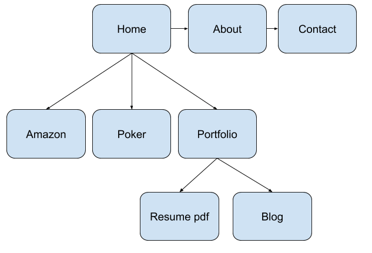
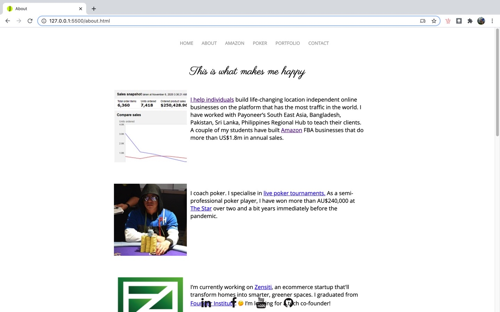

# JENSEN CHOW Sydney flextrack 
## Portfolio 15 Nov 2020

### Published portfolio website
[www.JenSodicta.com](https://www.jensodicta.com)

### Github repo
[https://github.com/jensenrex/portfolio-2020](https://github.com/jensenrex/portfolio-2020)

### Description of my portfolio website
#### Purpose
Assignment 1 for Coder Academy flex track

#### Functionality / features
- background image on home
- zoom on hover for sticky footer icons
- facebook messenger chat

#### Sitemap

#### Screenshots
1. Home

1. About 

#### Target audience
- an employer looking to engage a dev
- prospective clients for amazon and poker (will drive traffic to those pages only)

#### Tech stack 
- html
- css
- deployment platform: 
